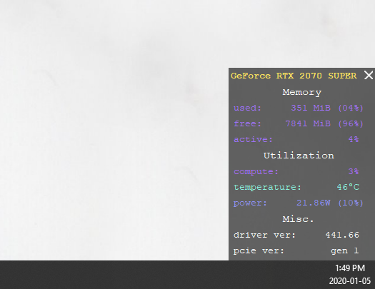

# Sidelight GPU monitor
TL;DR a lightweigth live GPU monitor that sits in the corner of your screen (or second screen).

Pros:
- Very small
- Super lightweight
- Easily customizable (even more so for those who know a little python)

Cons:
- Requires manual installation and python

Here's what it looks like with an RTX2070 super:

## Features
- Customizable size/location, update frequency...
- Works for any (reasonably new) Nvidia GPU
- Statistics are color graded from a deep blue when the resource is hardly being used, to a bright red when the resource is being fully used.

## Requirements
- Windows 10
- Nvidia GPU with Nvidia GPU driver installed
- Python 3.6+ with matplotlib (or Anaconda)

## Installation
1. Download the latest release from the 'releases' tab in this repo
2. Extact the zip file to wherever you want on your computer
3. Install python 3.6+ with matplotlib.
   - If python is not installed, install it from https://www.python.org/downloads/ (3.6+, usually go for the newest one).
   - Once installed, open cmd and run `pip install matplotlib`.
   - OPTIONAL: if you already have [Anaconda](https://www.anaconda.com/distribution), you can skip separately installing python and just uncomment the first line in the bash script `sidelight.bat` (by removing the two `:: ` characters) once you have unzipped.
4. Customize installation
    - Open `settings.config` in your favorite text editor (notepad, whatever)
    - Adjust the first 4 lines to be your primary (and optionally secondary) screen size. Each line has a comment to indicate what it does, so feel free to mess around and customize things how you like, but to get things up and running you only need to adjust the first 4 settings to be your primary and secnodary screen size. Note that primary screen is the one windows identifies as screen 1 in your display settings. PS: Adjusting this also allows you to place the sidelight widget anywhere on the screen if you are careful enough.
 5. Test it out! Try double clicking `sidelight.bat` to start sidelight. Note it may take a couple of seconds for the statistics to first update.

That's it :). 

## Making sidelight automatically start when the computer starts
Finding and clicking `sidelight.bat` each time you start your PC can be quite annoying, so to automatically run sidelight whever you login to your PC, do this:
1. In the start menu, search "schedule tasks", and click on the Schedule tasks result.
2. In the right panel, hit `create basic task`, enter a name and description of your choice.
3. Hit next, select trigger for every time you log on, next, chose `start a program`, next, for the program to run, use the Browse button to select the `sidelight.bat` file from where you extracted sidelight. Hit next, finish and you're done!

Now whenever you logon to your PC, it will start sidelight :).

